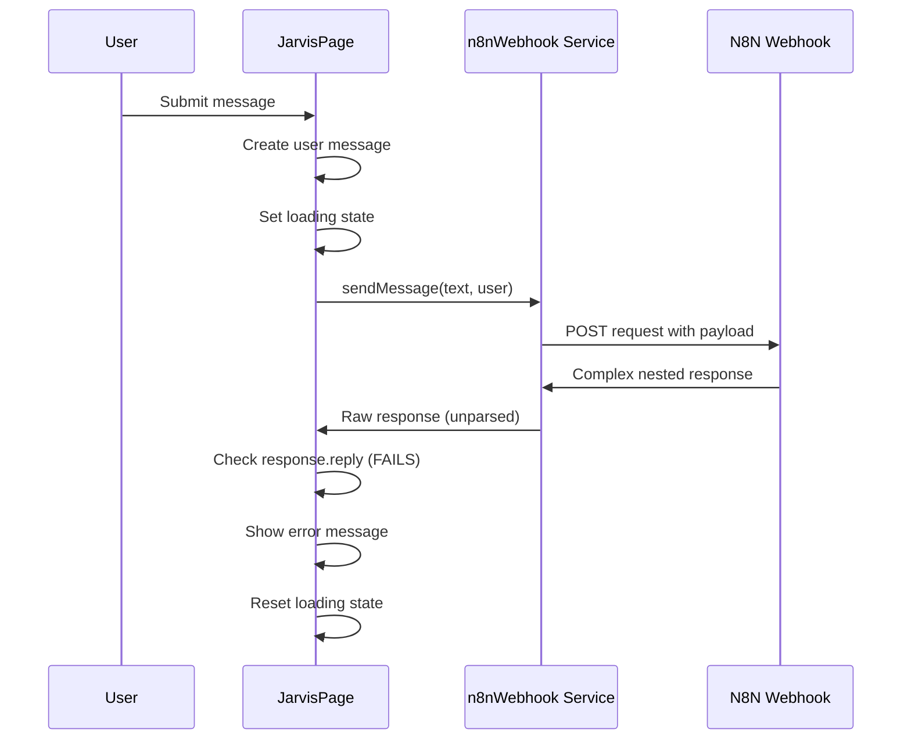

# Technical Analysis: JarvisPage.tsx N8N Webhook Integration Issues

## Executive Summary

The current integration between JarvisPage.tsx and the n8n webhook endpoint has critical data parsing issues that prevent successful communication. The webhook returns a complex nested response structure, but the frontend expects a simple format, causing all requests to fail.

## Current Issues Identified

### 1. **Critical Data Structure Mismatch**
- **Expected by Frontend**: `{reply: "AI response text"}`
- **Actual Webhook Response**: 
```json
[
  {
    "response": {
      "body": [
        {
          "output": "Olá! Como posso ajudar você hoje?"
        }
      ],
      "headers": {},
      "statusCode": 200
    }
  }
]
```
- **Impact**: All webhook responses fail validation in [`JarvisPage.tsx:64-66`](src/pages/JarvisPage.tsx:64)

### 2. **Insufficient Error Handling**
- Generic error messages without specific failure types
- No distinction between network, parsing, or webhook-specific errors
- Missing retry logic for transient failures
- No graceful degradation for webhook unavailability

### 3. **Missing TypeScript Type Safety**
- No interfaces for webhook request/response structures
- Loose typing allows runtime errors to go undetected
- No validation of user data before sending to webhook

### 4. **Network Configuration Issues**
- Missing ngrok-specific headers for tunnel bypass
- No CORS configuration for cross-origin requests
- Timeout handling present but not optimized

### 5. **Limited Debugging Capabilities**
- Console logging present but insufficient for production debugging
- No request/response logging for troubleshooting
- Missing performance metrics

## Data Flow Analysis



## Technical Specification for Resolution

### 1. **Response Parsing Layer**
```typescript
interface N8NWebhookResponse {
  response: {
    body: Array<{
      output: string;
    }>;
    headers: Record<string, any>;
    statusCode: number;
  };
}

interface ParsedAIResponse {
  reply: string;
  success: boolean;
  metadata?: {
    statusCode: number;
    timestamp: string;
  };
}
```

### 2. **Error Handling Strategy**
```typescript
enum WebhookErrorType {
  NETWORK_ERROR = 'NETWORK_ERROR',
  TIMEOUT_ERROR = 'TIMEOUT_ERROR',
  PARSING_ERROR = 'PARSING_ERROR',
  INVALID_RESPONSE = 'INVALID_RESPONSE',
  RATE_LIMIT = 'RATE_LIMIT',
  WEBHOOK_UNAVAILABLE = 'WEBHOOK_UNAVAILABLE'
}

interface WebhookError {
  type: WebhookErrorType;
  message: string;
  originalError?: Error;
  retryable: boolean;
}
```

### 3. **Retry Logic Implementation**
- Exponential backoff starting at 1 second
- Maximum 3 retry attempts
- Only retry on network/timeout errors
- Circuit breaker pattern for sustained failures

### 4. **Request Enhancement**
```typescript
interface WebhookRequest {
  message: string;
  user: {
    id: string;
    email?: string;
  };
  metadata: {
    timestamp: string;
    sessionId: string;
    clientVersion: string;
  };
}
```

## Implementation Plan

### Phase 1: Core Fixes (Critical)
1. Fix response parsing in [`n8nWebhook.js`](src/services/n8nWebhook.js)
2. Add TypeScript interfaces for all data structures
3. Update [`JarvisPage.tsx`](src/pages/JarvisPage.tsx) to handle new response format

### Phase 2: Robustness (High Priority)
1. Implement comprehensive error handling
2. Add retry logic with exponential backoff
3. Add ngrok-specific headers and CORS configuration

### Phase 3: Production Readiness (Medium Priority)
1. Add comprehensive logging and debugging
2. Implement request/response validation
3. Add performance monitoring
4. Create fallback UI components

## Success Criteria

- [ ] All webhook requests successfully parse responses
- [ ] Proper error messages displayed for different failure types
- [ ] Retry logic handles transient failures automatically
- [ ] TypeScript compilation with no type errors
- [ ] End-to-end chat functionality working reliably
- [ ] Production-ready error boundaries and logging

## Risk Assessment

### High Risk
- Response parsing fix affects core chat functionality
- Breaking changes to existing message flow

### Medium Risk
- TypeScript migration may reveal existing bugs
- Retry logic could increase response latency

### Low Risk
- Enhanced logging and debugging features
- UI improvements and loading states

## Testing Strategy

1. **Unit Tests**: Webhook service response parsing
2. **Integration Tests**: End-to-end message flow
3. **Error Scenario Tests**: Network failures, malformed responses
4. **Performance Tests**: Response time under load
5. **User Acceptance Tests**: Chat functionality validation